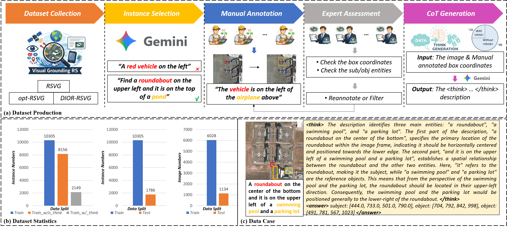

<h3> Think and Answer ME: Benchmarking and Exploring Multi-Entity Reasoning Grounding in Remote Sensing </h3>

  

    
    
    <a href='https://www.baidu.com' style='padding-left: 0.5rem;'>
      
  

[Shuchang Lyu](https://scholar.google.com.hk/citations?user=SwGcxzMAAAAJ&hl=zh-TW), [Haiquan Wen](https://scholar.google.com/citations?user=hQadNAUAAAAJ), [Guangliang Cheng](https://scholar.google.com/citations?user=FToOC-wAAAAJ&hl=en), Meng Li, [Zheng Zhou](https://scholar.google.com/citations?user=L5o4LTcAAAAJ&hl=en&oi=sra), [You Zhou](https://scholar.google.com.hk/citations?user=dfEZDv4AAAAJ&hl=en), [Dingding Yao](https://scholar.google.com/citations?user=UrqQkEsAAAAJ&hl=zh-CN), [Zhenwei Shi](https://scholar.google.com.hk/citations?user=kNhFWQIAAAAJ&hl=en&oi=ao)

Welcome to our work **EAR**, for multi-entity reasoning grounding in remote sensing.

In this work, we propose:

> ✅ **One Dataset:** **ME-RSRG:** A new benchmark dataset for Multi-Entity Reasoning Grounding in Remote Sensing!
>
> ✅ **One Framework: EAR:** An Entity-Aware Reasoning framework based on visual-linguistic foundation models.
>
> ✅ **Two-Stage Optimization:** Combining supervised fine-tuning with entity-aware reward-driven GRPO.
>

## Proposed Dataset: ME-RSRG

  
    <figcaption>
  <strong>(a) Dataset production.</strong> The construction pipeline of ME-RSRG follows a 5-step process: dataset collection, instance selection, manual annotation, expert assessment, and CoT generation.
  <strong>(b) Dataset statics.</strong> ME-RSRG contains 7,162 images and 12,091 image-text instances, split into 10,305 training instances and 1,786 test instances.
  <strong>(c) Data case.</strong> Representative examples showing large-scale spatial layouts, multi-entity ambiguity, and structured reasoning requirements.
</figcaption>

## Proposed Method: EAR Framework

  
    <figcaption>
  <strong>Overview of EAR framework.</strong> We adopt a two-stage optimization strategy. SFT is first applied as a cold-start initialization. With SFT-parameters loaded to policy model, entity-aware reward-driven GRPO is then employed to further refine the model.
</figcaption>

